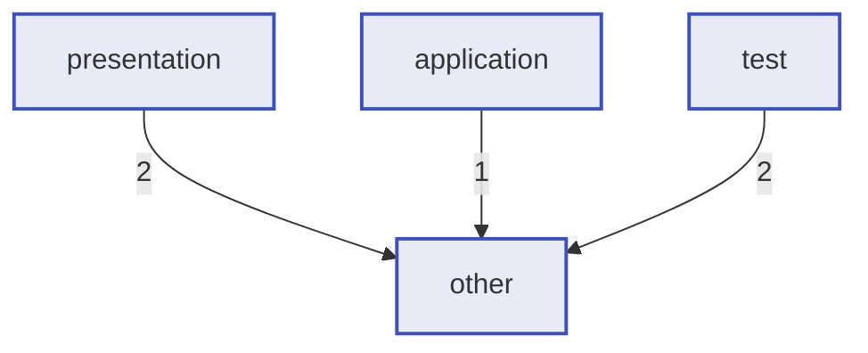

```
   ___          _                          _
  / __\___   __| | ___  __ _ _ __ __ _ _ __ | |__
 / /  / _ \ / _` |/ _ \/ _` | '__/ _` | '_ \| '_ \
/ /__| (_) | (_| |  __/ (_| | | | (_| | |_) | | | |
```

**Local code graph, shared memory and guardrails for AI coding assistants.**

Parses your repo into a graph of files, functions, classes, Terraform resources, and Markdown documentation -- then exposes it as an MCP server so Claude Code, Cursor, Codex, and Gemini can do symbol-level lookups instead of reading entire files. On top of the graph: a knowledge and session memory every connected agent shares, and a confidentiality layer (findings, egress gate, per-agent guard hooks) that decides what an agent may read and what may reach a cloud model.

**Result:** 60-90% fewer tokens on typical navigation tasks, learnings that survive context clears, and nothing leaving the machine without a gate.

---

## Install

**Python 3.11, 3.12, 3.13, or 3.14.** Since v0.4.2 Kuzu is an optional
extra (`pip install cgh[kuzu]`), so the default install no longer pulls a
package that lacks cp3.14 wheels. The DuckDB backend ships wheels on every
supported Python and is the default everywhere. Existing Kuzu repos are
auto-migrated to DuckDB on the next `cgh init`. Use `CGH_DB=kuzu` (with
the extra installed) to keep using Kuzu if you have a reason to.

### One-line install

The install scripts detect your environment (macOS, Linux, WSL, Git Bash, or
native Windows), install cgh, and offer to add the `cgh` command to your PATH.

macOS, Linux, WSL, Git Bash ([install.sh](./install.sh)):

```bash
curl -fsSL https://raw.githubusercontent.com/altikva/cgh/main/install.sh | bash

# Core + the five first-party plugins in one shot:
curl -fsSL https://raw.githubusercontent.com/altikva/cgh/main/install.sh | CGH_PLUGINS=1 bash
```

Windows PowerShell ([install.ps1](./install.ps1)):

```powershell
irm https://raw.githubusercontent.com/altikva/cgh/main/install.ps1 | iex

# Core + the five first-party plugins in one shot:
$env:CGH_PLUGINS = 1; irm https://raw.githubusercontent.com/altikva/cgh/main/install.ps1 | iex
```

### With pip, pipx, or uv

```bash
# From PyPI (most users)
pip install cgh

# Isolated install that also handles PATH for you
pipx install cgh        # or: uv tool install cgh

# From source (for development)
git clone https://github.com/altikva/cgh.git
cd cgh
uv pip install -e .     # or: pip install -e .
```

Optional extras (none are required; the core install is lean and works on Python 3.11 through 3.14):

```bash
pip install "cgh[plugins]" # the five first-party plugins (docs, pii, summarize, classify, bugreport)
pip install "cgh[langs]"   # C# and Ruby parsers (tree-sitter grammars, abi3 wheels)
pip install "cgh[lsp]"     # precise cross-file Python call resolution (jedi)
pip install "cgh[kuzu]"    # the legacy Kuzu graph backend (DuckDB is the default)

# Combine extras in one bracket, comma-separated:
pip install "cgh[langs,lsp]"

# Or everything above except kuzu, in one shot:
pip install "cgh[full]"
```

Quote the package spec (`"cgh[...]"`) so zsh and bash do not try to glob the brackets. The same form works with `pipx install`, `uv tool install`, `uv pip install`, and from a source checkout: `pip install -e ".[langs,lsp]"`.

```bash
cgh --version
cgh init           # initialize in any project
cgh serve          # start the MCP server for Claude / Cursor / Codex / Gemini
```

### If `cgh` is not found after install

`pip install` drops the `cgh` executable in a Scripts directory that is not
always on PATH (common on Windows). Two fixes:

```bash
# Run it as a module, no PATH change needed
python -m cgh --version

# Or add the cgh command's directory to your PATH
python -m cgh ensurepath
```

`pipx install cgh` and `uv tool install cgh` avoid this by managing PATH
themselves. The Python import name is still `codegraph` (e.g.
`from codegraph.parsers import ...`); only the CLI is named `cgh`, same
pattern as `pip install pillow` then `import PIL`.

---

## Quick Start

```bash
# 1. Initialize (interactive wizard)
cgh init

# 2. Build the graph
cgh index

# 3. Check what was indexed
cgh stats

# 4. Start the MCP server for your AI tool
cgh serve --watch --reindex
```

---

## How It Works

```
AI Assistant (Claude / Cursor / Codex / Gemini)
    |  symbol_lookup("process_data")
    |  search_docs("reconciliation")
    |  context_for_task("fix auth bug")
    v
MCP server (codegraph)          <-- stdio, no network
    |  SQL graph query + BM25 FTS
    v
DuckDB graph DB (.codegraph/graph.duckdb)   <-- embedded, file-based (default)
                                            -- or Kuzu graph.db via CGH_DB=kuzu
SQLite FTS5 (.codegraph/fts.db)       <-- BM25 full-text search
    |  indexed from
    v
Your source files (.py / .ts / .tf / .md / .vue)
    ^
File watcher (watchdog)         <-- live incremental updates on save
```

Instead of reading `services.py` (800 tokens) to find where `verify_token` is defined, your AI calls `symbol_lookup("verify_token")` and gets back:

```json
{
  "file": "src/auth/services.py",
  "lines": "42-55",
  "kind": "function",
  "doc": "Verify a JWT token, raise on expiry."
}
```

Then reads only lines 42-55.

---

## CLI Reference

All commands accept `--root <DIR>` to target a different project. The CLI is `cgh`; the Python import is `codegraph` (see Install above).

### Getting Started

#### `init`

Interactive wizard that detects AI tools, installs MCP configs, and indexes the project.

```bash
cgh init
cgh init --yes    # accept all defaults (non-interactive)
```

```text
   ___          _                          _
  / __\___   __| | ___  __ _ _ __ __ _ _ __ | |__
 / /  / _ \ / _` |/ _ \/ _` | '__/ _` | '_ \| '_ \
/ /__| (_) | (_| |  __/ (_| | | | (_| | |_) | | | |
\____/\___/ \__,_|\___|\__, |_|  \__,_| .__/|_| |_|
                       |___/          |_|

  Project: /home/user/my-project

  Detecting AI tools...

    > Claude Code     detected
    > Cursor          detected
    - Codex CLI       not found
    - Gemini CLI      not found

  ? Install MCP server for: (space to toggle, enter to confirm)
    [x] Claude Code  (MCP server + hooks)
    [x] Cursor       (MCP server + hooks)

    + .mcp.json (MCP server)
    + .claude/settings.json (post-commit hook)
    + .cursor/mcp.json (MCP server)

  Files to index:

    python        142 files  >>>>>>>>>>>>>>>>>>>>>>>>>>>>
    typescript      8 files  >>
    terraform      12 files  >>
    markdown       23 files  >>>>>

  ? Index 185 files now? Yes

  ...indexing...

+-----------------------+
| codegraph is ready!   |
|                       |
|   cgh stats           |
|   cgh search X        |
|   cgh serve           |
|   cgh parsers         |
|   cgh --help          |
+-----------------------+
```

#### `index`

Build or rebuild the full code graph. Uses `git ls-files` for file discovery.

```bash
cgh index
cgh index --verbose
```

```text
  Indexing (git ls-files)  [################........]  142/185  api/handlers/donation_handler.py  3.2s

+--------------------+--------+
| Index Summary      |        |
+--------------------+--------+
| Files indexed      |    185 |
| Files skipped      |      3 |
| Errors             |      0 |
| Elapsed            |  4.1s  |
| Method             | git_ls |
+--------------------+--------+
```

#### `serve`

Start the MCP server over stdio. This is the command AI tools invoke.

```bash
cgh serve --root . --watch --reindex
```

Flags:
- `--watch` -- enable live file watcher (watchdog, debounced)
- `--reindex` -- rebuild the graph before accepting connections

#### `setup`

Generate integration files for a specific AI tool without the interactive wizard.

```bash
cgh setup claude
cgh setup cursor
cgh setup codex
cgh setup gemini
cgh setup bob
cgh setup all
```

### Query

#### `search`

Fuzzy search symbols (functions, classes, doc sections) by name.

```bash
cgh search "Handler"
cgh search "Handler" --limit 5
cgh search "Handler" --json
```

```text
  Search: Handler
+------+----------------------------+-------------------------------+
| Type | Symbol                     | Location                      |
+------+----------------------------+-------------------------------+
| fn   | DonationHandler            | api/handlers/donation.py:12   |
| fn   | ReceiptHandler             | api/handlers/receipt.py:8     |
| cls  | BaseHandler                | api/handlers/base.py:15       |
| fn   | PaymentHandler             | api/handlers/payment.py:22    |
+------+----------------------------+-------------------------------+
```

#### `lookup`

Find the exact definition of a symbol.

```bash
cgh lookup verify_token
```

```text
  fn  verify_token  api/middleware/auth.py:42-55
```

#### `callers`

Show all functions that call a given function (tree view).

```bash
cgh callers verify_token
```

```text
verify_token is called by:
+-- get_current_user  api/dependencies.py:18
+-- require_role      api/middleware/auth.py:72
+-- portal_auth       api/routers/portal.py:34
```

#### `callees`

Show all functions that a given function calls (tree view).

```bash
cgh callees get_current_user
```

```text
get_current_user calls:
+-- verify_token       api/middleware/auth.py:42
+-- load_user_by_id    api/managers/user_manager.py:15
+-- build_current_user api/dependencies.py:30
```

#### `outline`

Display the heading structure of a Markdown file as a tree.

```bash
cgh outline CLAUDE.md
cgh outline docs/ARCHITECTURE.md
```

```text
CLAUDE.md
+-- ondonne-api -- FastAPI Backend  L1
|   +-- Project overview  L5
|   +-- Tech stack  L30
|   +-- Architecture -- 4-layer request flow  L45
|   |   +-- Entity registration (factory pattern)  L52
|   +-- Provider architecture (plugin system)  L60
|   |   +-- Mobile Money provider architecture  L85
|   |   +-- Payment routing strategy  L110
|   +-- Multi-tenancy model  L200
|   +-- User roles & access control (RBAC)  L215
```

#### `graph`

Visualize the code graph in the browser as interactive Mermaid diagrams.

```bash
cgh graph                          # overview (default)
cgh graph imports                  # file import graph
cgh graph calls --symbol verify    # call graph filtered to a symbol
cgh graph classes                  # class inheritance tree
cgh graph docs                     # documentation structure
cgh graph imports --file auth.py   # imports for a specific file
cgh graph calls --mermaid          # output raw Mermaid to stdout
cgh graph imports --html out.html  # save to file instead of opening browser
cgh graph overview --max-nodes 20  # limit nodes
```

Scopes: `overview`, `imports`, `calls`, `classes`, `docs`, `layers` (layer-to-layer dependency diagram)

```text
+--------------------------------------------+
| codegraph                                  |
|                                            |
|   Opened in browser                        |
|   File: /tmp/codegraph/codegraph-calls.html|
|   Scope: calls                             |
|   Nodes: 40 max                            |
+--------------------------------------------+
```

`cgh graph layers --mermaid` prints the layer-dependency diagram, which renders inline on GitHub:



### Monitor

#### `stats`

Display graph nodes, edges, MCP call stats, FTS index size, and storage.

```bash
cgh stats
cgh stats --json
```

```text
         Graph Nodes
 Type          Count
 File            185  ##########..........
 Function      1,204  ####################
 Class            85  ####................
 TFResource       14  #...................
 TFVar             9  ...................
 MdSection       230  ########............
 Total         1,727

         Graph Edges
 Relationship        Count
 CALLS               3,412
 IMPORTS                892
 DEFINES_FN          1,204
 DEFINES_CLASS          85
 INHERITS               47
 HAS_METHOD            312
 DEFINES_SECTION       230
 MD_REFS_SYMBOL         89
 Total               6,271

         Index Info
 FTS symbols          1,533
 graph.duckdb          2.5 MB
 fts.db                2.1 MB
 call_log.db            48 KB
 Total storage         4.7 MB

       MCP Tool Calls
 Tool               Calls  Avg ms  Max ms  Errors
 context_for_task       42    18.3    45.2       0
 symbol_lookup          38     2.1     8.4       0
 search_symbols         15     3.5    12.1       0
 fts_search             12     4.2    15.3       0
 find_callers            8     1.8     4.2       0
 Total                 115                       0
```

#### `logs`

View MCP tool call history with latency and status.

```bash
cgh logs
cgh logs --tool symbol_lookup
cgh logs --errors
cgh logs --limit 10
cgh logs --json
cgh logs --clear
```

```text
       Call Logs (last 10)
 Time                 Tool             Latency  Size  Args
 2026-04-11 14:32:01  OK  symbol_lookup   2.1ms  142B  name=verify_token
 2026-04-11 14:31:58  OK  context_for_task 18ms  1,204B  task=fix auth bug
 2026-04-11 14:31:45  OK  fts_search      4.2ms  892B  query=donation handler
 2026-04-11 14:30:12  ERR find_callers    1.2ms    0B  fn_name=nonexistent
```

#### `history`

Show recent MCP activity grouped by day.

```bash
cgh history
cgh history --days 14
```

```text
     Activity -- Last 7 Day(s)
 Date         Calls  Errors  Top Tools
 2026-04-11      42       0  context_for_task(18), symbol_lookup(12), fts_search(8)
 2026-04-10      31       1  symbol_lookup(15), find_callers(8), search_docs(5)
 2026-04-09      28       0  context_for_task(12), search_symbols(9), graph_stats(4)

 Total: 101 calls, 1 errors across 3 day(s)
```

#### `diff`

Show files changed since the last index, categorized by parseability.

```bash
cgh diff
cgh diff --since HEAD~3
cgh diff --since main
```

```text
  Changed Files (parseable) since HEAD
 File                               Language
 api/routers/donations.py           .py
 api/handlers/receipt_handler.py    .py
 CLAUDE.md                          .md

  + 2 non-parseable changed file(s)

+----------------------------------------------+
| 3 parseable changed  |  0 new unindexed  |  2 other |
+----------------------------------------------+
```

#### `impact`

Report the blast radius of changes since a git ref, for CI and PR bots. Diffs the changed files, then reports the symbols they define, what transitively imports them (grouped by role/layer), the endpoints touched, and the tests to run. Reads the graph read-only, so no MCP server needs to be running; keep the index fresh with `cgh index` in CI.

```bash
cgh impact --since HEAD~1            # human-readable summary
cgh impact --since main --format md  # markdown for a PR comment
cgh impact --since main --json       # machine-parseable on clean stdout
```

```text
## cgh impact (since `HEAD~1`)

**Changed files (1)**
- `api/models/donation.py`

**Impacted files (3)**
- application (1)
  - `api/handlers/receipt_handler.py` `handler`
- presentation (1)
  - `api/routers/donations.py` `router`
- test (1)
  - `tests/test_receipt.py` `test`

**Endpoints touched (1)**
- `POST /donations` (api/routers/donations.py)

**Tests to run (1)**
- `tests/test_receipt.py`
```

#### `parsers`

List all registered language parsers.

```bash
cgh parsers
```

```text
              Registered Parsers
 Language      Extensions        Extracts                    Description
 python        .py               functions, classes, imports  Python source files (tree-sitter)
 typescript    .ts .tsx .js .mjs  functions, classes, imports  TypeScript/JavaScript (tree-sitter)
 terraform     .tf               resources, variables, outputs Terraform HCL files
 markdown      .md .mdx          sections, links, code_refs  Markdown documentation
 vue           .vue              functions, classes, imports  Vue SFC files

 Total: 9 file extensions supported
```

### Maintenance

#### `doctor`

Health check that verifies all codegraph components are working.

```bash
cgh doctor
```

```text
            Health Check
 Component        Status
 .codegraph/ dir  OK  initialized
 graph.duckdb     OK  accessible
 fts.db           OK  accessible
 call_log.db      OK  accessible
 config.toml      OK  valid
 parsers          OK  5 parser(s) loaded
 git              OK  found
 .cghignore       !!  not found (optional)
 MCP server       OK  ready

+-----------------------------+
| All 9 checks passed.       |
+-----------------------------+
```

#### `compact`

Vacuum SQLite databases and reclaim disk space.

```bash
cgh compact
```

```text
         Compact Results
 Database          Before   After   Saved
 fts.db            2.3 MB   2.1 MB  -200 KB
 call_log.db       52 KB    48 KB   -4 KB
 graph.duckdb      2.5 MB   2.5 MB  --

+----------------------------------+
| Reclaimed: 204 KB               |
+----------------------------------+
```

### Advanced

#### `watch`

Index the repo then watch for file changes indefinitely.

```bash
cgh watch
cgh watch --verbose
```

```text
  Initial index done -- 185 files in 4.1s
  Watching for changes... (Ctrl-C to stop)
```

#### `add-dir`

Manage extra directories included in the graph (multi-repo support).

```bash
cgh add-dir list                   # list configured extra dirs
cgh add-dir add ../frontend        # add a directory
cgh add-dir add ../infra           # add another
cgh add-dir remove ../frontend     # remove a directory
```

```text
  Extra directories:

  OK  ../ondonne-frontend  (/home/user/ondonne-frontend)
  OK  ../ondonne-infra     (/home/user/ondonne-infra)
```

#### `federate`

Federate sub-repos that each have their own `.codegraph/` index. The parent indexes only files outside any subrepo and queries fan out to each child's read-only DB at runtime. Each result is tagged with a `scope` field (`parent` or the child's name). See the [Federation](#federation) section for the full model.

```bash
cgh federate add ./apps/api ./apps/web   # declare subrepos
cgh federate list                         # status table (status, owner, git, path)
cgh federate verify                       # exits 1 if any child is unhealthy
cgh federate up                           # spawn each child's own watcher
cgh federate down                         # stop them all
cgh federate remove ./apps/api            # un-federate
```

```text
+------------------+--------+-----------+-----+------------------+
| subrepo          | status | owner     | git | path             |
+------------------+--------+-----------+-----+------------------+
| ondonne-frontend | ok     | up :54052 | yes | ./ondonne-frontend |
| ondonne-infra    | ok     | down      | yes | ./ondonne-infra    |
+------------------+--------+-----------+-----+------------------+
```

`cgh init` auto-detects nested `.codegraph/` directories and offers to federate them on the spot.

Since 0.6.0 the parent owner starts each initialized child's owner (with watcher) automatically when it comes up; those children stop on their own once the parent owner exits. `cgh federate up` remains the way to start children that outlive the parent. Opt out with `federate_auto_up = false` under `[codegraph]` in the parent's config.

#### `force-index`

Index files that are in `.gitignore`, bypassing all ignore rules. Requires confirmation.

```bash
cgh force-index build/output.py docs/generated/
cgh force-index build/output.py --yes    # skip confirmation
```

```text
+-----------------------------------+
| Force Index                       |
|                                   |
|   build/output.py                 |
|   docs/generated/                 |
|                                   |
| Bypasses .gitignore and           |
| .git/info/exclude                 |
+-----------------------------------+
Continue? [y/N] y

Force-indexed 4 file(s)
```

---

## Federation

When you work in a parent folder that holds several sub-projects, each with its own `.git` and its own `.codegraph/` index, you don't want the parent to re-index everything. Per-child `.gitignore` semantics get lost, large trees (node_modules, vendor) get walked, duplicate work explodes. The federation model fixes this:

- The parent **only indexes files outside any declared subrepo** (its README, top-level configs, cross-repo docs).
- Each subrepo keeps its own `.codegraph/` as the canonical index for its own code.
- At MCP query time, the parent **fans out read-only queries** to each child's DB and aggregates results, tagging every hit with a `scope` field (`parent` or the child's basename).

### Setup

```bash
# In each subrepo (one-time)
cd apps/api && cgh init && cgh index

# In the parent
cd ../..
cgh init                                   # auto-detects nested .codegraph/, offers to federate
cgh federate add ./apps/api ./apps/web     # (or declare manually)
cgh federate list                          # status + owner state per child
cgh index                                  # parent indexes only its own files
cgh serve --background --watch             # parent owner federates queries to children
                                           # and auto-starts each child's owner + watcher
cgh federate up                            # optional: children that OUTLIVE the parent owner
```

### What's federated

| MCP tool | Behavior |
|---|---|
| `symbol_lookup`, `search_symbols`, `find_callers`, `find_callees` | Concat results, each tagged with `scope` |
| `imports_of`, `subgraph` | Concat. Cross-repo IMPORTS edges are NOT inferred (each scope's graph is canonical for its own files) |
| `pattern_search` | Runs ripgrep in each scope's tree |
| `fts_search` | Concat then sort by score (BM25 not renormalized across repos) |
| `search_docs`, `doc_outline`, `doc_refs` | Concat |
| `architecture_overview` | Returns `{by_scope: {parent: {...}, child1: {...}}}` when subrepos are present |
| `domain_map`, `endpoints` | Concat with per-result scope tag |
| `find_dead_code` | **Per-scope analysis**. A symbol "dead" in scope X may be called from scope Y. The response carries an explicit `note` field reminding you not to delete blindly. |

### What's NOT federated

`knowledge_*`, `memory_*`, `plan_*`, all write-side tools (`index`, `force_index`, `incremental_reindex`, `add_directory`), and `context_for_task` stay parent-local. Each project keeps its own knowledge / memory / plans store.

### Resilience

If a child's DB is locked or unavailable (its own owner is mid-write, the child got deleted from disk), the response carries `partial: true` and `warnings: [{scope, error}]`. Results from other scopes still flow. Re-query in a moment if you need full coverage.

Owners are independent: the parent reads child DBs directly as files, it does NOT auto-spawn child owners. Use `cgh federate up` to ensure every child has its own watcher running, or accept that a child without a live owner may serve slightly stale data.

---

## MCP Tools

When running as an MCP server (`cgh serve`), codegraph exposes 50 tools, plus whatever installed plugins register.

### Architecture Awareness (call these FIRST)

| Tool | Description |
|------|-------------|
| `architecture_overview(max_files_per_role?)` | Compact map of all files grouped by layer (presentation/application/domain/infra/test/doc) and role (handler/router/component/store/…) with 1-line summaries: no Read needed |
| `domain_map(keyword, limit_per_role?)` | Every file whose path / role / module_doc mentions the keyword, grouped by role |
| `endpoints(path_pattern?, method?)` | List HTTP endpoints (FastAPI, Flask, Nuxt, Express, Django urls, NestJS, Spring, Gin/Echo) with their handlers: works cross-repo when `extra_dirs` is configured |

### Code Navigation

| Tool | Description |
|------|-------------|
| `symbol_lookup(name, role?, layer?)` | Find where a function, class, TF resource, or doc section is defined; optional `role` / `layer` filters |
| `find_callers(fn_name)` | Find all functions that call `fn_name` |
| `find_callees(fn_name)` | Find all functions that `fn_name` calls |
| `imports_of(file_path)` | List modules imported by a file |
| `search_symbols(query, limit?, role?, layer?)` | Fuzzy search across all symbol types; optional `role` / `layer` filters |
| `subgraph(file_path, depth?)` | Find files related within N import hops (blast radius) |
| `graph_stats()` | Node and edge counts per type |

### Code Intelligence

| Tool | Description |
|------|-------------|
| `file_summary(file_path)` | One-shot orientation for a file: role/layer/lang, its functions and classes with line ranges, what it imports, and who imports it |
| `impact_of(symbol_or_file, max_depth?)` | Reverse blast radius: everything that transitively calls or imports the target, grouped by role/layer, with reaching endpoints |
| `path_between(src, dst, edge?)` | Shortest path between two symbols/files over `CALLS` or `IMPORTS` |
| `import_cycles(limit?)` | Detect import cycles (strongly-connected components) in the file import graph |
| `tests_for(symbol_or_file)` | Test files that exercise the target (inferred from imports/calls + role, not coverage) |
| `untested(role?, layer?)` | Source files that no test file imports |
| `hotspots(limit?)` | Change-risk ranking: git churn x import centrality x recency |
| `who_knows(file_path)` | Top authors of a file by commit count and recency (from git history) |

### Documentation

| Tool | Description |
|------|-------------|
| `search_docs(query, limit?)` | Search Markdown by heading title or body content |
| `doc_outline(file_path)` | Table of contents of a Markdown file |
| `doc_refs(symbol_name)` | Find all docs that reference a code symbol |

### Full-Text & AI Context

| Tool | Description |
|------|-------------|
| `fts_search(query, limit?, kind?)` | BM25-ranked full-text search over names + docstrings |
| `context_for_task(task, max_nodes?)` | Build ranked context from graph + FTS for any task |
| `find_dead_code(file_path?, include_private?)` | Find symbols with no incoming edges (potentially unused) |

### Indexing

| Tool | Description |
|------|-------------|
| `scan_repo(verbose?)` | Full re-index of the entire repo |
| `index_changed_files(since?)` | Re-index only files changed since a git ref |
| `force_index(paths, confirmed?)` | Index files bypassing .gitignore (requires confirmation) |

### Visualization

| Tool | Description |
|------|-------------|
| `visualize_graph(scope, file_path?, symbol_name?, max_nodes?, format?)` | Generate Mermaid or Graphviz diagrams |

### Statistics

| Tool | Description |
|------|-------------|
| `call_stats()` | MCP tool usage statistics (calls, latency, errors) |
| `live_graph_stats()` | Polling-friendly snapshot: node counts + FTS size + scan freshness + timestamp |

### Scan Freshness & Incremental Updates

| Tool | Description |
|------|-------------|
| `scan_status()` | Is the graph in sync with `git HEAD`? Returns `fresh`, `indexed_sha`, `behind_by`, `changed_files` |
| `incremental_reindex()` | Surgical reindex: compares per-file git blob SHAs and touches only what actually changed since the last scan |
| `add_directory(path)` | Hot-add an external directory (sibling repo) to the graph: persists to config, scans, extends the watcher. No restart needed. |

---

## Parser Plugin Architecture

codegraph supports any language through a plugin system. Adding a new language requires one file and zero configuration changes.

### Supported Languages

| Language | Parser | Extensions | Extracts |
|----------|--------|------------|----------|
| Python | tree-sitter | `.py` | functions, classes, imports, calls, inheritance, docstrings |
| TypeScript | tree-sitter | `.ts` `.tsx` | functions, classes, imports, calls, inheritance |
| JavaScript | tree-sitter | `.js` `.mjs` | functions, classes, imports, calls |
| Vue | tree-sitter | `.vue` | functions, classes, imports (SFC script block) |
| Go | tree-sitter | `.go` | functions, methods, structs, interfaces, imports, calls |
| Rust | tree-sitter | `.rs` | functions, structs, enums, traits, impl methods, use, calls |
| Java | tree-sitter | `.java` | classes, interfaces, methods, constructors, imports, calls |
| Terraform | regex + brace tracker | `.tf` | resources, variables, outputs, depends_on |
| Markdown | regex | `.md` `.mdx` | headings, internal links, code symbol references |
| Config data | stdlib + PyYAML | `.json` `.yaml` `.yml` `.toml` | top-level keys as sections (CI jobs, k8s kinds, compose services, package.json scripts, pyproject tables) |
| SQL | regex | `.sql` | `CREATE TABLE` / `ALTER TABLE` as table sections with columns |
| C# (optional) | tree-sitter | `.cs` | classes, interfaces, structs, enums, records, methods, usings, calls |
| Ruby (optional) | tree-sitter | `.rb` | classes, modules, methods, requires, calls |

C# and Ruby ship in the optional `langs` extra (`pip install "cgh[langs]"`, abi3 wheels that cover every Python cgh supports) so the core install stays lean. When the extra is absent, those file types are simply skipped.

### Adding a New Language

1. Create a file in `codegraph/parsers/` (e.g., `rust.py`)
2. Subclass `BaseParser`
3. Decorate with `@register_parser`
4. Done -- auto-discovered on import

```python
from codegraph.parsers import register_parser
from codegraph.parsers.base import BaseParser, FileIndex, SymbolDef, ClassDef, ImportRef

@register_parser(".rs")
class RustParser(BaseParser):
    lang = "rust"
    extensions = [".rs"]
    extracts = ["functions", "structs", "traits", "impls"]
    description = "Rust source files"
    tree_sitter_lang = "rust"  # optional: auto-installs grammar

    def parse(self, path: Path) -> FileIndex:
        # Parse the file and return a FileIndex
        ...
```

See `docs/PARSERS.md` for a complete walkthrough.

---

## Plugins

cgh discovers pip-installed plugins through the `cgh` entry point group: install one, and the next run picks it up. A plugin can add file parsers, per-file scanners, MCP tools, and CLI subcommands through a small versioned API (`codegraph.plugin_api`, contracts documented in its docstrings).

```bash
pip install some-cgh-plugin   # discovery is automatic
cgh plugins                   # list plugins: status, version, surfaces
```

Control which plugins load per repo in `.codegraph/config.toml`:

```toml
[plugins]
# disabled = ["heavy-plugin"]     # skip without uninstalling
# enabled = ["docs", "pii"]       # allowlist mode: load ONLY these

[plugin.pii]                      # per-plugin settings, passed verbatim
# ner = false
```

A broken or incompatible plugin degrades to a warning and a status line in `cgh plugins`, never a crash. Trust model: a plugin is Python executed with cgh's privileges, same as any pytest or flake8 plugin; install what you trust, pin versions, and use allowlist mode on sensitive repos. Plugins licensed under any terms are welcome: see the plugin exception in [LICENSE](./LICENSE).

First-party plugins live in [plugins/](./plugins) and install separately, so the core stays lean; grab all five at once with `pip install "cgh[plugins]"`:

| Plugin | What it adds |
|---|---|
| `cgh-docs` | pdf, docx and xlsx files become searchable sections |
| `cgh-pii` | inline PII and secret detection (emails, IBANs, cards, keys) |
| `cgh-classify` | human-trainable confidentiality labels + a local classifier |
| `cgh-summarize` | file summaries via your agent CLIs, Ollama or any OpenAI-compatible endpoint, plus `cgh insights` |
| `cgh-bugreport` | crash reports built by allowlist, spooled locally, sent by hand to a private repo |

---

## Findings, modes and the guard

Scanner plugins attach **findings** to files (`pii.email`,
`secret.aws_key`, `confidential`, `summary`, ...), stored in SQLite next
to the index and queryable anytime with `cgh findings` or the federated
`findings` MCP tool, even while a server is running.

One switch names your posture in `.codegraph/config.toml`:

```toml
[codegraph]
mode = "assist"   # default: optimize for token savings and flow
# mode = "secure" # assist + enforcement: nothing turns off, gates are added
```

What the findings feed:

- **The egress gate** (cgh-summarize): a file flagged confidential, or
  carrying secrets or PII, never reaches a cloud model. In `secure`
  mode the gate is an allowlist: only files a human labeled
  non-confidential go out. Every cloud send is logged.
- **The guard**: `cgh init` / `cgh setup` install pre-tool-use hooks in
  your agents, so the agent's own Read, Grep and shell calls are denied
  on flagged files, with a named reason. `cgh guard status` shows the
  honest per-agent map: Claude Code and Gemini CLI enforce (read and
  shell veto), Codex CLI is partial (shell veto only), agents without a
  veto surface are listed unprotected. In `secure` mode the guard fails
  closed and flagged paths also sync into static Claude deny rules.

This is policy enforcement inside cooperating agent frameworks, not a
sandbox: an agent free to run arbitrary code can read what the OS
allows. The guard narrows the path; `mode = "secure"` narrows it hard.

---

## Session memory

cgh is the memory that survives context clears, shared by every agent
that connects:

- **`checkpoint` / `resume`** (MCP): save a session digest before a
  clear; get back ONE ranked, budget-capped bundle: standing
  instructions first, then digests, task-relevant knowledge, open
  plans, and recent file summaries.
- **Automatic in Claude Code**: hooks record a checkpoint marker at
  compaction and session end, and a two-line header at session start
  announces the bundle; the full bundle loads only when used.
- **Standing instructions**: durable rules recorded with
  `knowledge_record(kind="standing_instruction", ...)` lead every
  bundle. Entries can supersede older ones, and `cgh memory review`
  lists stale entries for pruning.
- What Claude learns in the morning, Gemini knows in the afternoon:
  writes go through cgh, agent-native memories are indexed read-only.

---

## Configuration

codegraph uses a layered config system. See `docs/CONFIGURATION.md` for all options.

### Resolution Order (later wins)

1. Hardcoded defaults
2. Global: `~/.codegraph/config.toml`
3. Project: `.codegraph/config.toml`
4. Environment variables
5. CLI flags

### Quick Reference

```toml
# .codegraph/config.toml

[codegraph]
ignore_dirs = [".git", "node_modules", "__pycache__", ".venv"]
ignore_patterns = ["*.min.js", "*.bundle.js"]
max_file_size_kb = 500
extra_dirs = ["../frontend"]
# precise_calls = true       # resolve Python calls cross-file via jedi (needs cgh[lsp])
# subrepos = ["./apps/api"]  # federated children (see cgh federate)
# federate_auto_up = true    # parent owner auto-starts each child's owner

[parsers]
# enabled = ["python", "typescript", "markdown"]
# disabled = ["terraform"]

[mcp]
auto_watch = true
reindex_on_start = true
```

### Environment Variables

| Variable | Description |
|----------|-------------|
| `CODEGRAPH_ROOT` | Override project root |
| `CODEGRAPH_DIR` | Override `.codegraph/` location |
| `CGH_DB` | Graph backend: `duckdb` (default) or `kuzu` |
| `CGH_PRECISE_CALLS` | `1` to resolve Python calls cross-file via jedi (needs `cgh[lsp]`) |

### `.cghignore`

Optional file at the project root. Same syntax as `.gitignore`. Patterns listed here are excluded from indexing in addition to `.gitignore`.

---

## Integration Guides

### Claude Code

Add to `.mcp.json` (auto-generated by `cgh init`):
```json
{
  "mcpServers": {
    "codegraph": {
      "command": "codegraph",
      "args": ["serve", "--root", ".", "--watch", "--reindex"],
      "env": {
        "CODEGRAPH_AUTH_KEY": "<auto-generated key from .codegraph/auth.key>"
      }
    }
  }
}
```

See `integrations/claude-code.md` for hooks setup and best practices.

### Cursor

Add to `.cursor/mcp.json`:
```json
{
  "mcpServers": {
    "codegraph": {
      "command": "codegraph",
      "args": ["serve", "--root", ".", "--watch", "--reindex"],
      "env": {
        "CODEGRAPH_AUTH_KEY": "<auto-generated key from .codegraph/auth.key>"
      }
    }
  }
}
```

See `integrations/cursor.md` for `.cursorrules` instructions.

### Codex CLI

See `integrations/codex.md` for `AGENTS.md` instructions.

### Gemini CLI

See `integrations/gemini.md` for `GEMINI.md` instructions.

### Automatic Setup

```bash
cgh init         # interactive: detects tools, installs configs
cgh setup all    # non-interactive: generates all integration files
```

---

## Graph Schema

```
File --IMPORTS-----------> File
File --DEFINES_FN--------> Function
File --DEFINES_CLASS-----> Class
File --DEFINES_RESOURCE--> TFResource
File --DEFINES_TFVAR-----> TFVar
File --DEFINES_SECTION---> MdSection

Function --CALLS---------> Function
Class --HAS_METHOD-------> Function
Class --INHERITS---------> Class
TFResource --TF_DEPENDS--> TFResource

MdSection --CONTAINS_SECTION--> MdSection    (heading hierarchy)
MdSection --MD_LINKS_TO-------> File         (internal doc links)
MdSection --MD_REFS_SYMBOL----> Function     (code references in docs)
MdSection --MD_REFS_CLASS-----> Class        (code references in docs)
```

---

## Token Savings

| Task | Without codegraph | With codegraph |
|------|-------------------|----------------|
| Find where `process_data` is defined | Read 3-5 files (~2,000 tokens) | `symbol_lookup` (< 50 tokens) |
| Find all callers of `save_record` | Read every candidate file | `find_callers` (< 50 tokens) |
| Understand blast radius of `utils.py` | Read imports manually | `subgraph` (< 100 tokens) |
| Find docs about reconciliation | Read all `.md` files | `search_docs` (< 50 tokens) |
| Build context for a task | 5-10 file reads (~5,000 tokens) | `context_for_task` (< 200 tokens) |

---

## Security

### MCP Auth Key

`cgh init` generates a cryptographic auth key at `.codegraph/auth.key` (auto-added to `.gitignore`). The owner process and every worker / CLI caller read that file and send it as a `Bearer` token to the owner's loopback HTTP bridge, which compares it in constant time. The file contents are the shared secret: there is no environment-variable hand-off.

```bash
# Key is auto-managed -- no manual steps needed
cgh init          # generates the key and the .codegraph/ index dir
```

The key file has `600` permissions and the `.codegraph/` directory is `700` (owner-only). Never commit either to git.

---

## Limitations

- **CALLS resolution is name-based by default.** A call is linked to a same-file function of that name, falling back to all repo functions with that name only when there is no same-file match, so cross-file call edges are best-effort. For Python you can opt into precise cross-file resolution with `pip install cgh[lsp]` and `precise_calls = true` (jedi-backed); other languages stay name-based.
- **Terraform HCL uses regex, not a full grammar.** Complex meta-arguments may be missed.
- **JS/TS imports resolve to local files only.** Relative imports (`import x from "./utils"`), tsconfig `paths` aliases, and workspace packages do create a `File -> File` IMPORTS edge. Bare external packages (`import react`) are not resolved to a node, and cross-repo edges are not inferred (each federated scope is canonical for its own files).
- **Markdown code refs are heuristic.** PascalCase and snake_case patterns are matched, so a ref can be a false positive.
- **Large repos take minutes to index.** DuckDB (the default backend) is several times faster than the old Kuzu path, but a first scan of a very large tree is still bound by parsing every file. Incremental updates stay fast (well under a second per changed file), and a pull or merge reindexes only the changed files via the git hooks.

---

## License

Dual-licensed under MIT **and** CC BY-NC-SA 4.0: both licenses apply together and you must comply with both. In practice that means non-commercial use, share-alike derivatives, attribution, and no warranty. Copyright (c) 2026 ALTIKVA. See [LICENSE](./LICENSE) or the canonical notice at https://www.altikva.com/licenses/LICENSE-1.0.

**Plugin exception**: a plugin that talks to cgh only through the documented plugin interfaces (the `cgh` entry-point group and the public plugin API) is not treated as a derivative work and may be licensed under any terms its author chooses, including commercial ones. Using cgh itself stays under the dual license whatever plugins are installed. Full wording in [LICENSE](./LICENSE).
